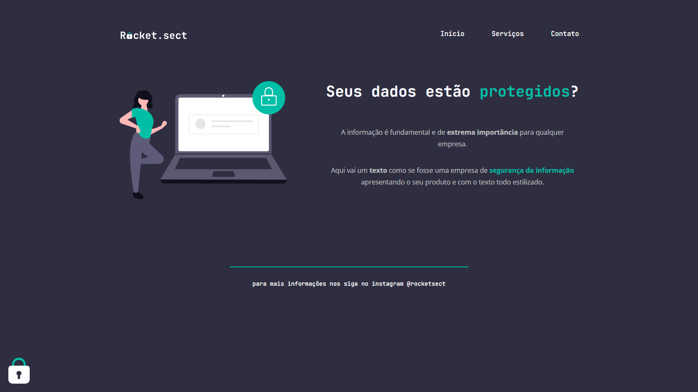

  <h1 align="center"> Explorer Stage 02 | Projeto 03 </h1>

  

  Projeto exclusivo do curso Explorer, promovido pela Rocketseat.
  

  
    
    <a href="#-projeto">Projeto</a>&nbsp;&nbsp;&nbsp;|&nbsp;&nbsp;&nbsp;
    <a href="#-layout">Layout</a>&nbsp;&nbsp;&nbsp;|&nbsp;&nbsp;&nbsp;
    <a href="#-tecnologias">Tecnologias</a>&nbsp;&nbsp;&nbsp;|&nbsp;&nbsp;&nbsp;
  

  

    
  

   

  

  ## 💻 Projeto

  > Explorer
  
  Projeto foi desenvolvido para o curso de formação da Rocketseat Explorer stage 02 da turma 6.0, projeto final do stage 02 para consolidar os conhecimentos básicos de HTML e CSS

  ## 🔖 Layout

  Você pode visualizar o projeto através [DESSE LINK](https://explorer-stage2-pjfinal.vercel.app/).
  
  ## 🚀 Tecnologias

  Esse projeto foi desenvolvido com as seguintes tecnologias:

  - HTML e CSS
  - Git e Github
