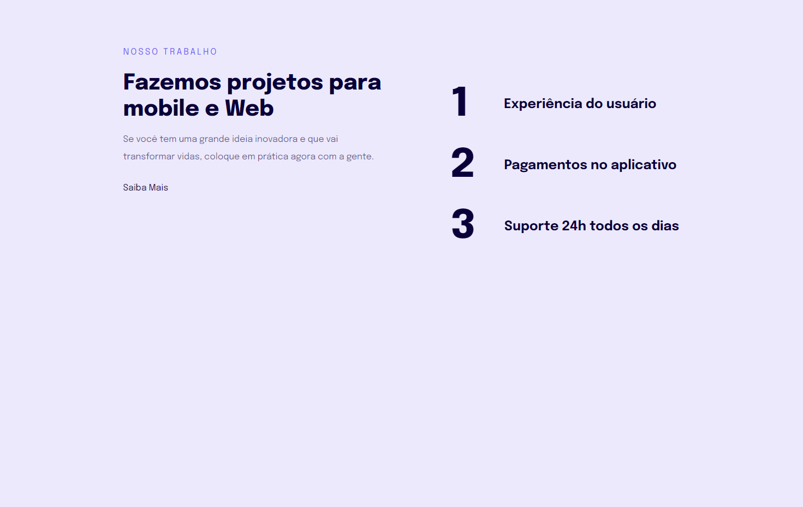

  <h1 align="center"> Explorer Stage 03 | Projeto 06 - Responsividade </h1>

  

  Projeto exclusivo do curso Explorer, promovido pela Rocketseat.
  

  

    <a href="#-tecnologias">Tecnologias</a>&nbsp;&nbsp;&nbsp;|&nbsp;&nbsp;&nbsp;
    <a href="#-projeto">Projeto</a>&nbsp;&nbsp;&nbsp;|&nbsp;&nbsp;&nbsp;
    <a href="#-layout">Layout</a>&nbsp;&nbsp;&nbsp;|&nbsp;&nbsp;&nbsp;
  

  

    
  

   

  

  ## 🚀 Tecnologias

  Esse projeto foi desenvolvido com as seguintes tecnologias:

  - HTML e CSS
  - Git e Github

  ## 💻 Projeto

  > Explorer

  Projeto foi desenvolvido para o curso de formação da Rocketseat Explorer stage 03 da turma 6.0, este projeto simples consiste na aplicação de responsividade.

  ## 🔖 Layout

  Você pode visualizar o projeto através [DESSE LINK](https://felipepleao.github.io/courseProjects-rocketseat/projeto06--stg-03/).
